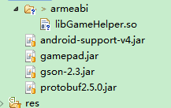
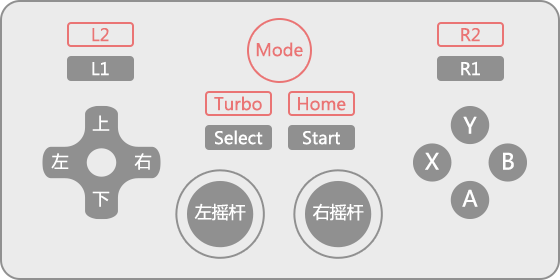

# GamePadSDK

####版本  

>VSzone1.1
####Change Log  
v1.1
1. 增加 针对未适配的手柄 提供映射界面.
2. 增加 当前支持的手柄列表展示界面
3. 增加 当前已经插入到设备上的列表界面
4. 上述界面UI资源均以Android Libarry 的形式提供,与libgamepad.jar独立,故可单独使用.
5. 提升兼容性(android4.0-5.1)

#### 功能
针对目前手柄没有统一标准,导致各个手柄在使用的过程中出现各种问题，游戏开发者在对手柄的兼容性适配将会成为一个头大的问题，在这种状况下，手柄SDK出现了。
GamePad SDK提供在android和yunOS操作系统上对游戏手柄的适配，功能如下
1：对于APP应用情景 使用手柄的A，B键模拟确认,返回的操作,控制应用的操作.
2：对于游戏情景 提供**上下左右方向键,左摇杆,A，B，X，Y，start， slect， L1， L2**等八键的适配
3：兼容市面上诸多手柄,并对新上市手柄提供在线的,持续的,及时的兼容性更新.


-----
### 示例DEMO
如何开发一个支持手柄操作的 <2048>游戏
项目地址 https://github.com/KoVszone/GamePad
``` git
git clone https://github.com/KoVszone/GamePad

```
DEMO中因为签名关系会出现手柄未适配从而使用不正常的现象,更换接入KEY即可解决.

#### SDK接入步骤：
1：**权限和KEY:**在AndroidManifest.xml 添加如下代码段：
``` xml
    <!-- 手柄兼容文件在线更新 -->
    <uses-permission android:name="android.permission.ACCESS_NETWORK_STATE"/>
    <!-- 手柄兼容文件缓存 -->
    <uses-permission android:name="android.permission.WRITE_EXTERNAL_STORAGE"/>
    <uses-permission android:name="android.permission.INTERNET"/>
  <application...>
      .
      .
       <meta-data android:value="%s" android:name="KO_APP_KEY"></meta-data>
      .
      .
   </application>
``` 
其中 **%s** 为应用标示，该值由第三方开发者工程的包名和签名MD5指纹计算，具体获取和计算方法请发送电子邮件[tv_service@vszone.cn](tv_service@vszone.cn),邮件标题需要以[sdk]开头.

2：**初始化:**在AndroidManifest.xml中android:name标签指定的类中初始化SDK
意图是在应用启动时就初始化SDK。
代码示例如下：
``` xml
---------
AndroidManifest.xml
---------
  <application
        android:name=".APP"
        .
        .
```        
``` java       
---------
APP.java   
---------
public class APP extends Application {

    @Override
    public void onCreate() {
        super.onCreate();
        .
        .
        GamePadManager gp = GamePadManager.getInstance(this);
        .
        .
        
    }
```
override需要使用手柄的Activity的相关方法.(通常在Activity基类中重写即可)
```Java
class BaseActivity extends Activity{

     @Override
    public boolean dispatchGenericMotionEvent(MotionEvent ev) {
        ev = GamePadManager.getInstance(this).dispatchGenericMotionEvent(ev);
        if (!InputDeviceUtils.isValueMotionEvent(ev)) {
            return true;
        }
        return super.dispatchGenericMotionEvent(ev);
    }
    @Override
    public boolean dispatchKeyEvent(KeyEvent event) {
        event = GamePadManager.getInstance(this).dispatchKeyEvent(event);
        // must return true;
        if (event.getKeyCode() == KeyEvent.KEYCODE_UNKNOWN) { return true; }
        return super.dispatchKeyEvent(event);
    }
```

3: **依赖** 在android工程的构建路径中加入SDK的依赖jar包

**libgamepad.jar**//SDK
**libGameHelper.so** //SDK
**gson-2.3.jar**//JSON
**protobuf2.5.0.jar**//google通信协议
 
以eclipse工程为例 在../libs下



**完成以上1,2,3点后,APP或者游戏就有了支持手柄的能力**

4:**接口拓展**

>拓展 让手柄控制游戏和应用


4.1:实现OnPlayerListener接口
当SDK的模式为游戏模式时.回调该接口.(接口不可做耗时操作,否则会造成按键事件丢失)
如何切换SDK的模式见下文
```
OnPlayerListener mOnPlayerListener = new OnPlayerListener(){

        @Override
        public void OnPlayerEnter(Player player) {
            //有手柄接入 其中player.id 对应P1 P2 P3 P4...
            
        }

        @Override
        public void OnPlayerExit(Player player) {
            //有手柄拔出 
            
        }

        @Override
        public boolean onPlayerMotionEvent(Player player, MotionEvent ev) {
            // 通过摇杆控制游戏  MotionEvent说明见后续的JAVA Document

            return false;
        }

        @Override
        public boolean onPlayerKeyEvent(Player player, KeyEvent ev) {
            // 通过按键控制游戏 KeyEvent说明见后续JAVA Document
            return false;
        }
        
    };
```
4.2:注册以接收手柄的按键事件和模式切换
**GamePadManager.EVENT_MODE_GAME** 表示切换为游戏模式 
**GamePadManager.EVENT_MODE_SYSTEM** 表示切换为应用模式,按手柄的AB键将会达到确认和返回的效果
**registOnPlayerListener** APP只有在可见时才注册SDK的监听,以监听按键事件.
**unregistOnPlayerListener**APP在不可见时应该注销掉SDK的监听
```
    @Override
    protected void onResume() {
        super.onResume();
        GamePadManager.getInstance(this).setMode(GamePadManager.EVENT_MODE_GAME);
        GamePadManager.getInstance(this).registOnPlayerListener(mOnPlayerListener);
    }

    @Override
    protected void onPause() {
        super.onPause();
        GamePadManager.getInstance(this).setMode(GamePadManager.EVENT_MODE_SYSTEM);
      GamePadManager.getInstance(this).unregistOnPlayerListener(mOnPlayerListener);
    }
```
拓展 让手柄控制应用
```
    @Override
    protected void onResume() {
        super.onResume();
        GamePadManager.getInstance(this).setMode(GamePadManager.EVENT_MODE_SYSTEM);
        
    }

    @Override
    protected void onPause() {
        super.onPause();
        GamePadManager.getInstance(this).setMode(GamePadManager.EVENT_MODE_GAME);
        
    }
```

5: 注销SDK

    public void exitApp() {
        GamePadManager.getInstance(this).switchContext(null);
        GamePadManager.getInstance(this).destory();
    }
6:**虚拟手柄支持**,支持"KO电视游戏助手"虚拟手柄支持.仅局域网同子网段(**可选,不支持5.0及以上**)
>在AndroidManifest.xml中注册虚拟手柄服务
```xml
        <service
            android:name="cn.vszone.gamepad.virtual.VirtualGamdPadService"
            android:enabled="true"
            android:exported="true" >
            <intent-filter>
                <action android:name="VirtualGamdPadService" />
                <category android:name="android.intent.category.DEFAULT" />
            </intent-filter>
        </service>
```
>配置虚拟手柄拓展支持.(初始化SDK时 配置开启虚拟手柄支持)
```java
        ConfigBuilder configBuilder = new ConfigBuilder();
        configBuilder.configVirtualGamePadExtand();
        GamePadManager.getInstance(this).conifg(configBuilder);
```
>窗口切换 仅仅让当前的窗口支持虚拟手柄
```java
    @Override
    protected void onResume() {
        super.onResume();
        GamePadManager.getInstance(this).switchContext(this);
    }
    
```
###虚拟手柄下载地址


----


-----
### 关于混淆
在proguard配置文件中添加如下
>-libraryjars libgamepad.jar


### Java Doc
JAVA开发文档见 /doc

### 兼容性
android 4.1-5.0
yun OS 外设SDK2.7及以上 

###适配范围
提供了游戏中常用按键的适配,如下图中红色标注的按钮等非常见按键不在适配范围



###常见问题QA
Q1:异常 java.lang.VerifyError. **cn.vszone.gamepad
>解决方法 :按照步骤3 导入gson-2.3.jar,protobuf2.5.0.jar依赖文件

Q2:手柄使用异常,且有如下LOG 
>VSzone "WARN:the xxx is  invalid"
>解决方法:见SDK接入步骤1,使用正确的接入KEY

-----
### http://www.vszone.cn/
### Copyright © 2012 - 2014 VSzone. All Rights Reserved.